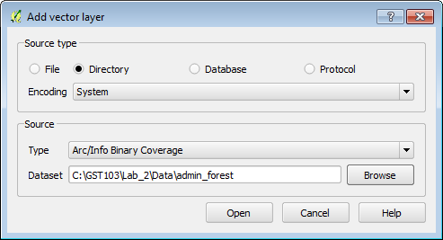
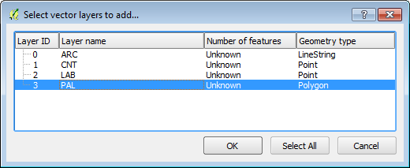
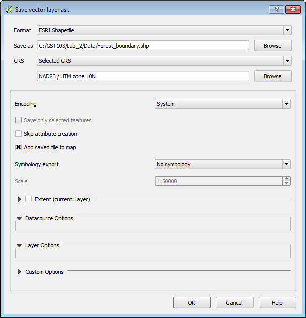
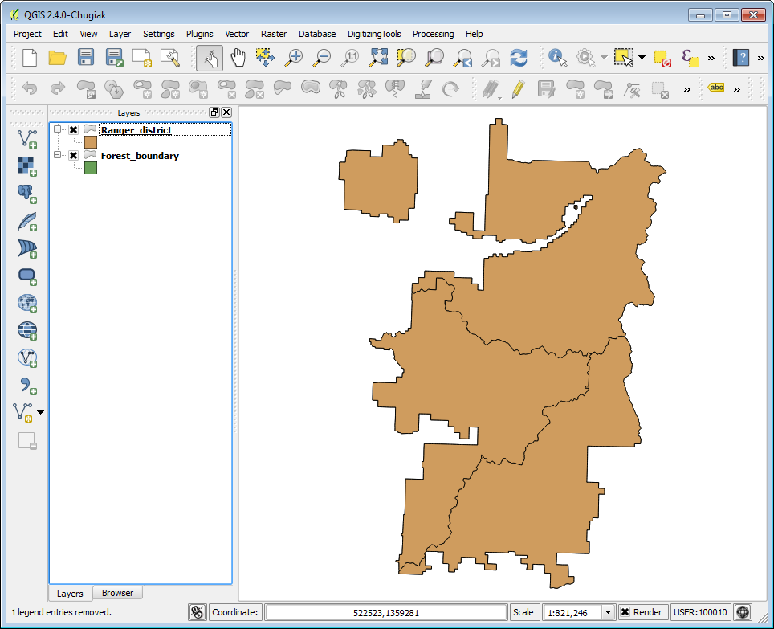
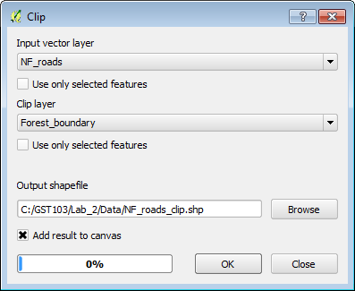
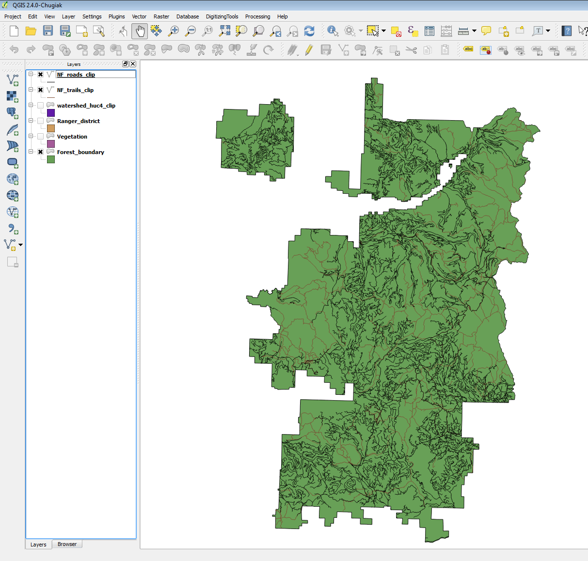
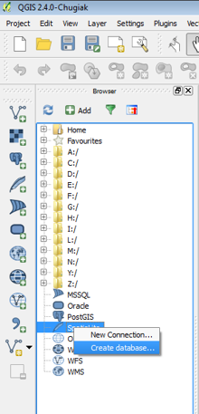
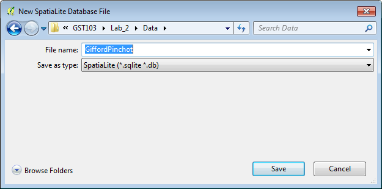
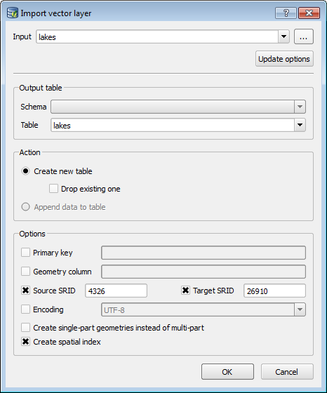
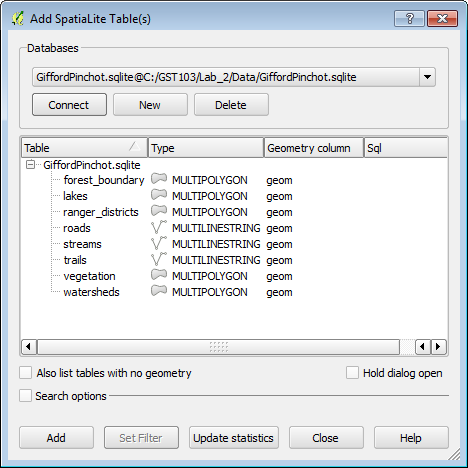

# GST 103: Data Acquisition and Management 
## Lab 2 - Setting Up a Project Database
### Objective – Learn How to Normalize Data and Import It into a SpatiaLite Database

Document Version: 9/16/2014

**FOSS4G Lab Author:**
Kurt Menke, GISP  
Bird's Eye View GIS

**Original Lab Content Author:**
Richard Smith, Ph.D.  
Texas A&M University - Corpus Christi

---

Copyright © National Information Security, Geospatial Technologies Consortium (NISGTC)

The development of this document is funded by the Department of Labor (DOL) Trade Adjustment Assistance Community College and Career Training (TAACCCT) Grant No.  TC-22525-11-60-A-48; The National Information Security, Geospatial Technologies Consortium (NISGTC) is an entity of Collin College of Texas, Bellevue College of Washington, Bunker Hill Community College of Massachusetts, Del Mar College of Texas, Moraine Valley Community College of Illinois, Rio Salado College of Arizona, and Salt Lake Community College of Utah.  This work is licensed under the Creative Commons Attribution 3.0 Unported License.  To view a copy of this license, visit http://creativecommons.org/licenses/by/3.0/ or send a letter to Creative Commons, 444 Castro Street, Suite 900, Mountain View, California, 94041, USA.  

This document was original modified from its original form by Kurt Menke and continues to be modified and improved by generous public contributions.

---

### 1. Introduction

There are two main data models for GIS data: vector and raster. Additionally, GIS data comes in many file formats. When gathering data for a project it is common to acquire data from several sources. Therefore, it is also common for the data to be in several different file formats. In this lab you will create a project geodatabase for the Gifford-Pinchot National Forest in Washington State. First, you will normalize the data. This means that you will put all datasets in the same coordinate reference system (CRS) and clip them to the study area boundary. Lastly, you will put them all into the same file format, a SpatiaLite geodatabase. 

This lab includes the following tasks:

Task 1 Investigate and Normalize Project Data

Task 2 Create a New Database 

Task 2 Populate the New Database

**2	Objective: Learn How to Normalize Data and Import It Into a SpatiaLite Database**

The objective of this lab is to explore and understand geospatial data models and file formats. 

**3	How Best to Use Video Walk Through with this Lab**

To aid in your completion of this lab, each lab task has an associated video that demonstrates how to complete the task.  The intent of these videos is to help you move forward if you become stuck on a step in a task, or you wish to visually see every step required to complete the tasks.

We recommend that you do not watch the videos before you attempt the tasks.  The reasoning for this is that while you are learning the software and searching for buttons, menus, etc…, you will better remember where these items are and, perhaps, discover other features along the way.  With that being said, please use the videos in the way that will best facilitate your learning and successful completion of this lab.

###Task 1		Investigate and Normalize Project Data

In this task, you will familiarize yourself with the lab data and will begin to normalize the data. 

2.	Open QGIS Browser, navigate to the Lab_2\Data folder and select the Data folder so that you see the contents in the Param tab. 
3.	There are eight vector layers here. There are four shapefiles, two kml files and two coverages (admin_forest and ranger_dist) (in the figure below). Each of these file formats will be treated in different ways. (NOTE: when there are multiple coverages in the same workspace they share the same info folder.)

4.	All the data for this project will need to be in UTM, zone 10, NAD83. Begin by identifying the coordinate reference system of each layer. Investigate the data layers and complete Table 1 below. This will tell you which layers will need to be saved to a new coordinate reference system.

LAYER  --  COORDINATE REFERENCE SYSTEM

admin  --  forest

ranger  --  dist

gp  --  veg041008

lakes

NF  --  roads

NF  --  trails

streams

watershed  --  huc4

5.	Open QGIS Desktop. Click the Add vector layer button and change the Source type to Directory. Then change the Type to Arc/Info Binary Coverage. Browse to the Data folder  and select the admin_forest folder. Click Select folder (in the figure below). Click Open.

6.	In the Select vector layers to add window choose 3 PAL (Polygon layer). Click OK. 

7.	Save your project as Lab 2.qgs.
8.	This layer is in a custom Albers Equal Area coordinate system. Since they are in a custom CRS there is no EPSG code to use during import into a database. First, you will save this out to a shapefile in the desired CRS. Right click on the layer and choose Save as… Save the resulting dataset to the Data folder and set the CRS to UTM zone 10 NAD 83 (EPSG 26910). (figure below). Once this is done you can Remove the PAL layer from QGIS Desktop.

9.	Repeat steps 5-7 for the Ranger District coverage. Once this has been completed, QGIS Desktop should resemble the figure below.

10.	The only other dataset in Albers Equal Area is the vegetation shapefile. Add the gp_veg041008.shp shapefile to QGIS Desktop and save this as a new shapefile in UTM.
11.	Add the NF_roads, NF_trails and watershed_huc4 shapefiles to QGIS Desktop. These layers are all shapefiles in the correct CRS. However, they extend beyond the forest boundary. Use the Vector -> Geoprocessing Tools -> Clip tool to clip each to the forest boundary (in the figure below). You can give them the same output name, but end it with clip. For example, NF_roads will become NF_roads_clip.

12.	Remove the original unclipped roads, trails and watershed layers once the three clip operations are complete. Your map should now resemble the figure below. 

13.	You have taken the initial steps to normalize the data. The rivers and lake layers are KML. KML is always in a geographic CRS with an EPSG code of 4326. These can be repojected when importing into the SpatiaLite database.
14.	Save your project.

###Task 2		Create a New Database

Now that you have taken the initial steps to prepare your data, you will create a new empty SpatiaLite database in which you will import your datasets.
	
1.	Open your Lab2.qgs project in QGIS Desktop if it not already.
2.	Click on the Browser tab at the bottom of the Table of Contents. If your Browser tab is not there go to View -> Panels -> Browser to turn it on. 
3.	Find the SpatiaLite database connection below your hard drives. Right click on it and choose Create database (figure below).

4.	Navigate to the Data folder and name the new database GiffordPinchot  and click Save (figure below).

5.	The database will now appear under the SpatiaLite database connection. Switch back to the Layers tab.
6.	Save your project.

###Task 3		Populate the New Database

Now you will populate the database with the eight layers.

1.	Open your Lab2.qgs project in QGIS Desktop if it not already.
2.	Add the stream and lake KML layers to QGIS Desktop.
3.	From the menu bar choose Database -> DB Manager -> DB Manager. Expand the SpatiaLite database connection (figure below). You will see the GiffordPinchot.sqlite database. If you expand the database, you will see many tables but no GIS layers yet.

4.	First you will load the streams and lakes layers. Since these are KML they are in a geographic CRS with an EPSG code of 4326. This is the case for all KML datasets.
5.	Click the Import layer/file button  .

6.	Set up the Input vector layer window as follows (figure below):

	a.	Set the Input as lakes

	b.	Name the table lakes

	c.	Click on Source SRID and enter 4326
	
	d.	Click the Target SRID and enter 26910

	e.	Click Create spatial index

	f.	Click OK

7.	Once the operation has completed successfully click the Refresh button    to see the lakes layer in the database.
8.	Repeat steps 5-7 for streams.
9.	Streams and Lakes were the final two layers that required a CRS reprojection. The remaining six UTM layers can now be imported. The only change is that both the input and target SRID’s will be 26910 (UTM zone 10 NAD83).
10.	 Click the Import layer/file button  .
11.	Set up the Input vector layer window as follows (figure below):

	a.	Set the Input as NF\_roads\_clip

	b.	Name the table roads

	c.	Click on Source SRID and enter 26910

	d.	Click the Target SRID and enter 26910

	e.	Click Create spatial index

12.	Click OK

13.	Repeat steps 10-12 for trails, watersheds, ranger districts, vegetation and forest boundary layers.
14.	Now that all eight layers have been imported you can remove the layers you have in QGIS Desktop.
15.	The layers in the database can be added via the DB Manager or the Add SpatiaLite Layer button. 
16.	If using the DB Manager, right click on a layer and choose Add to canvas. 
17.	If using the Add SpatiaLite Layer button  , select the database and click the Connect button. Once the layers appear, you can select them and click Add to add them to QGIS (figure below).

**5. Conclusion**

In this lab, you took data in several different file formats and CRS’s and normalized them. They are all now in the same CRS, clipped to the forest boundary and in a geodatabase. This methodology has the benefit of creating a working copy of the data. The raw data still exist. Therefore, if you accidentally delete or corrupt a dataset you still have the original to fall back on. Additionally, the data now all reside in a tidy database. Since they are all in the same CRS you can run any geoprocessing or analysis tools against them knowing they are all in UTM zone 10 NAD83.

**6	Discussion Questions**

1.	What are the steps involved in setting up a SpatiaLite database?
2.	What are the advantages of normalizing project data?

